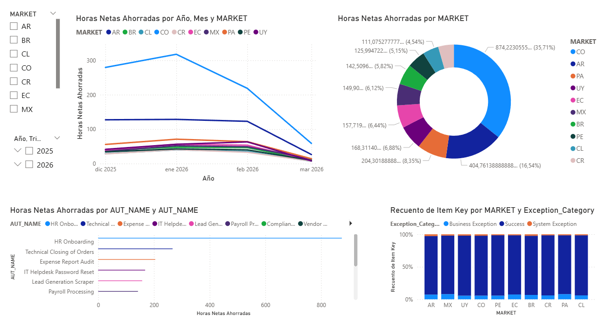

# py_pipeline_performance
End-to-end data analytics pipeline that transforms raw RPA execution logs into actionable business intelligence.



## 📌 Overview
This project bridges the gap between automation execution and business intelligence. It provides a robust pipeline to generate, process, and visualize RPA (Robotic Process Automation) performance metrics. By transforming raw transactional data into relational models, it calculates real ROI, FTEs saved, and exception distributions across different markets and automations.

## 🛠️ Tech Stack
* **Data Generation & ETL:** Python (Pandas, NumPy, Logging, Argparse)
* **Data Visualization & Analytics:** Power BI (Executive ROI Dashboard)

## 📂 Repository Structure
```text
py_pipeline_performance/
├── data/                     # Local data storage (Ignored in Git)
│   ├── inputs/               
│   └── outputs/              
├── docs/                     # Project documentation & assets
│   ├── screenshots/          
│   └── index.md              
├── src/                      # Main source code
│   ├── __init__.py
│   ├── config.py             # Centralized paths and global variables
│   ├── etl.py                # Core Extraction, Transformation & Load logic
│   ├── main.py               # Main orchestrator script
│   ├── parser.py             # Argument handler
│   └── simulator.py          # Data generator for DEV mode
├── tests/                   
│   └── testmain.py
├── .gitignore              
├── README.md           
└── requirements.txt      
```

# 🌟 Run Locally
1. Clone the repository and navigate to the project directory:

```bash
git clone [https://github.com/your-username/py_pipeline_performance.git]
cd py_pipeline_performance
```

2. Set up a virtual environment and install dependencies:

Create a virtual environment

```bash
python -m venv venv
```

Activate it (Windows)

```bash
venv\Scripts\activate
```

Activate it (Mac/Linux)

```bash
source venv/bin/activate
```

Install required packages

```bash
pip install -r requirements.txt
```

3. Run the pipeline in Development Mode (Recommended for testing):

This mode automatically generates 5,000+ realistic synthetic RPA logs and master data files before executing the ETL process.

```bash
python src/main.py --mode DEV
```

You can find the generated raw data in data/inputs/ and the final processed dataset in data/outputs/dev_analytics_dataset.csv.

5. Visualize the Data:
Connect your BI tool of choice (Power BI, Tableau, etc.) directly to the generated data/outputs/dev_analytics_dataset.csv file to explore the pre-calculated metrics, ROI, and exception distributions.